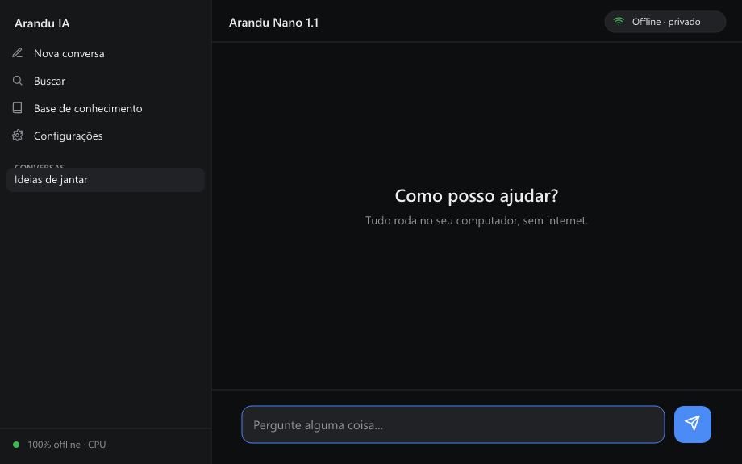

<h1 align="center">🌱 Arandu IA</h1>

<p align="center">
  <strong>Uma IA que conversa com você 100% offline — em português, na CPU, direto de um pendrive.</strong><br>
  Sem internet. Sem instalar nada. Sem que uma palavra saia do seu computador.
</p>

<p align="center">
  
  
  
  
  
  <a href="https://huggingface.co/celionormando/Arandu-Nano-1.1-GGUF"></a>
</p>

<p align="center">
  
</p>

> **Arandu** vem do tupi-guarani e significa *sabedoria* — **Ára** (tempo, cosmos)
> + **Andu** (sentir, ouvir). Um nome ancestral brasileiro para uma IA que mantém
> os pés no chão: útil, acessível e que respeita a sua privacidade.

## ✨ Por que o Arandu

- 🔒 **Privacidade total** — roda 100% local; nada é enviado para nuvem alguma
- 💻 **Leve** — funciona na CPU com ~1,2 GB de RAM (sem placa de vídeo)
- 🇧🇷 **Português do Brasil** — modelo calibrado para o nosso idioma (imatrix pt-BR)
- 🔌 **Clica e roda** — baixe, extraia e dê um clique; cabe num pendrive
- 📚 **Base de conhecimento offline (RAG)** — responde a partir dos *seus* documentos, sem inventar
- 🗣️ **Voz (TTS)** — voz do sistema ou **voz neural pt-BR offline** (Piper) para soar mais natural; histórico e streaming
- 🩺 **Assistente do sistema** — vê a saúde do PC (RAM/disco/CPU), sugere arquivos para limpar e, no Windows, lê agenda e e-mails do Outlook local — tudo offline
- 💸 **Livre e aberto** (Apache-2.0)

## ⬇️ Testar agora (Windows)

Baixe o pacote pronto, extraia e clique em `IA_Portatil.vbs`:

👉 **[Download — Arandu Nano 1.1](https://github.com/celionormando/arandu_nano/releases/latest)**

Passo a passo (e o aviso do SmartScreen) no `GUIA_DO_TESTADOR.md` dentro do pacote.

> Só quer o **modelo** (GGUF) para usar no seu próprio llama.cpp/llamafile?
> 🤗 **[Baixe no Hugging Face](https://huggingface.co/celionormando/Arandu-Nano-1.1-GGUF)** (Q4_K_M com imatrix pt-BR).

---

O **Arandu** é um assistente de IA de **uso geral** (conversa, redação, resumos,
tradução, ideias, dúvidas do dia a dia). O projeto inclui um kit para criar
**modelos próprios** via fine-tuning.

## Componentes
| Arquivo | Função |
|---|---|
| `chat.html` | Interface web em pt-BR (offline): streaming, histórico, voz (TTS) |
| `Iniciar_Arandu.vbs` | Lançador padrão — abre direto no **Arandu Nano 1.1** (sem menu) |
| `IA_Portatil.vbs` | Lançador 1 clique: sobe o servidor oculto e abre o navegador padrão |
| `iniciar.sh` | Lançador Linux/macOS: sobe o servidor e abre o navegador padrão |
| `iniciar_rag.sh` | Lançador Linux/macOS com RAG (chat + embeddings) |
| `modelo.txt` | Define o modelo ativo (1 linha) |
| `Usar_Nano_1.1.bat` / `Usar_Nano_1.0.bat` | Trocam entre as versões do Arandu |
| `Usar_1B_Rapido.bat` / `Usar_3B_Qualidade.bat` | Trocam para os modelos Llama base |
| `Desligar_IA.bat` | Encerra o servidor |
| `desligar.sh` | Encerra os servidores no Linux/macOS |
| `Painel_Saude.html` | Painel do assistente: saúde do sistema, limpeza, agenda e e-mail |
| `Painel_Saude.vbs` | Lançador 1 clique do painel (Windows) |
| `ferramentas/` | Ajudante do sistema: `saude_sistema.ps1` (Windows) e `saude_sistema.py` (Linux/macOS) |
| `iniciar.bat` / `iniciar_original.bat` | Alternativas com console |
| `treino/` | Kit de fine-tuning (notebook Colab + datasets) |
| `treino/imatrix/` | Calibração pt-BR + guia de re-quantização com **imatrix** |
| `NOMENCLATURA_MODELOS.md` | Famílias de modelos (Arandu/Katu/Vera/Taba) |
| `PLANO.md` | Documentação completa do projeto |

> **Não versionados** (grandes demais para o GitHub): os modelos `.gguf` e o
> `llamafile.exe`. Veja abaixo como obtê-los.

## Como montar (após clonar)
1. **Runtime** — baixe o `llamafile.exe`:
   https://github.com/Mozilla-Ocho/llamafile/releases (renomeie para `llamafile.exe`)
   - **Windows corporativo (AppLocker)?** Se o Windows bloquear o `llamafile.exe`
     ("Permissão negada" — ele é um binário APE), baixe o **llama.cpp** comum
     (https://github.com/ggml-org/llama.cpp/releases, asset `win-cpu-x64`) e extraia
     em uma pasta **`llama/`**. O `IA_Portatil.vbs` detecta e usa o `llama-server.exe`
     automaticamente (é um `.exe` normal, que passa no AppLocker).
2. **Modelo base** — baixe um GGUF e coloque na pasta:
   - Llama-3.2-1B: https://huggingface.co/bartowski/Llama-3.2-1B-Instruct-GGUF
   - Llama-3.2-3B: https://huggingface.co/bartowski/Llama-3.2-3B-Instruct-GGUF
   (arquivo `*-Q4_K_M.gguf`)
3. Ajuste o `modelo.txt` com o nome do `.gguf` escolhido.
4. Rode:
   - Windows: `IA_Portatil.vbs`
   - Linux/macOS: `chmod +x iniciar.sh iniciar_rag.sh desligar.sh` e depois `./iniciar.sh`

Os lançadores abrem a interface no navegador padrão do sistema.

## Base de conhecimento (RAG)
O Arandu pode responder com base em **documentos que você fornece** (offline):
1. Baixe o embedding `bge-m3-Q4_K_M.gguf` (repo `gpustack/bge-m3-GGUF`) e coloque em `rag/`.
2. Inicie pelo **`IA_Arandu_RAG.vbs`** no Windows ou **`./iniciar_rag.sh`** no Linux/macOS
   (sobe chat + servidor de embedding na porta 8091).
3. No chat, abra **Base de conhecimento**, cole textos ou envie `.txt/.md`, clique em
   **Indexar**, ligue o RAG (botão na barra) e pergunte.
- Vetores em **int8** (IndexedDB, no perfil da USB). Não busca na internet — só os
  documentos que você indexar.
- **Modo estrito** (ligado por padrão): responde só com base nos documentos e diz
  "Não encontrei isso na base de conhecimento" quando o tema não está coberto, em vez
  de inventar. Há um corte por relevância para descartar trechos pouco similares.

### Índice pré-construído (`rag/index.js`)
Documentos em `rag/docs/*.txt` já vêm indexados e são carregados automaticamente.
Para regenerar o índice após adicionar/editar documentos, com o servidor RAG no ar:

```sh
node rag/gerar_indice.mjs
```

## 🩺 Assistente do sistema
Além de conversar, o Arandu pode **enxergar o seu PC** — tudo **local e somente leitura**:

- **Saúde** — RAM, disco, CPU e tempo ligado, num painel completo e num **mini painel**
  fixo no canto superior direito do chat (aparece sozinho quando o ajudante está no ar).
- **Limpeza** — lista os arquivos que podem ser liberados (temporários, cache, lixeira…)
  com tamanho. O Arandu **mede e sugere; nunca apaga** — você decide e confirma.
- **Agenda e e-mail (Windows)** — lê os próximos compromissos e os e-mails recentes do
  **Outlook** local (via COM) e o Arandu resume. Só metadados; **o conteúdo das mensagens
  não é aberto**.

Como funciona: um pequeno **ajudante** roda ao lado (porta 8099) e responde por HTTP ao
navegador — `saude_sistema.ps1` (PowerShell) no Windows e `saude_sistema.py` (Python 3) no
Linux/macOS, com o **mesmo contrato**, então o painel é idêntico em todo SO. O modelo
**narra/resume**; os números vêm sempre do código (à prova de alucinação).

| Função | Windows | Linux | macOS |
|---|:---:|:---:|:---:|
| Saúde / Limpeza | ✅ | ✅ | ✅ |
| Agenda / E-mail | ✅ Outlook | 🔜 | 🔜 |

Abre junto com o chat (`IA_Portatil.vbs` / `./iniciar.sh`) ou sozinho pelo `Painel_Saude.vbs`.
Detalhes e arquitetura em [`ferramentas/README.md`](ferramentas/README.md).

## Criar seu próprio modelo (Arandu Nano)
Veja `treino/README.md`: notebook no Google Colab (GPU grátis) que faz
fine-tuning LoRA sobre o Llama-3.2-1B e exporta um `.gguf` Q4_K_M.

## Stack
- Motor: **llamafile** / llama.cpp (Apache-2.0), CPU-only
- Modelo padrão: **Qwen3-1.7B** quantizado Q4_K_M com **imatrix** pt-BR
  (matriz de importância — mais qualidade sem custo de RAM/velocidade;
  veja `treino/imatrix/`)
- Modelos base: **Llama 3.2** (1B/3B) quantizados Q4_K_M
- Treino: **Unsloth** (LoRA/QLoRA) no Google Colab
- Economia de RAM: os lançadores usam `--sleep-idle-seconds 180` — após 3 min
  ocioso o servidor **dorme** (libera a memória de trabalho) e **reacorda em
  ~2s** na mensagem seguinte. Útil quando o navegador é fechado sem desligar.

## Famílias de modelos
Arandu (G1 eficiência) → Katu (G2 raciocínio) → Vera (G3 multimodal) →
Taba (G4 agentes). Detalhes em `NOMENCLATURA_MODELOS.md`.

## Para testar (pacote pronto)
Quem só quer **experimentar** não precisa montar nada: use o `.zip` da página de
[Releases](https://github.com/celionormando/arandu_nano/releases) — baixe,
extraia e clique em `IA_Portatil.vbs`. Passo a passo em `GUIA_DO_TESTADOR.md`.

Para **gerar** esse pacote a partir do projeto (mantenedores):
```powershell
powershell -ExecutionPolicy Bypass -File empacotar.ps1            # leve (sem RAG)
powershell -ExecutionPolicy Bypass -File empacotar.ps1 -ComRAG    # completo (com RAG)
```

## Licença e créditos
O código do **Arandu** (interface, lançadores, scripts, RAG) é distribuído sob a
licença **Apache-2.0** — veja `LICENSE`.

O Arandu **redistribui** componentes de terceiros, cada um sob a própria licença:

| Componente | Autor | Licença |
|---|---|---|
| **llamafile** (motor) | Mozilla Ocho | Apache-2.0 |
| **Qwen3-1.7B** (modelo padrão) | Alibaba Cloud | Apache-2.0 |
| **bge-m3** (embeddings do RAG) | BAAI | MIT |
| **Llama 3.2** (modelos base, opcionais) | Meta | Llama 3.2 Community License |

> Os pesos da **Llama 3.2** têm licença própria da Meta (com restrições de uso);
> por isso o pacote de teste padrão usa o **Qwen3** (Apache-2.0), de
> redistribuição livre.
