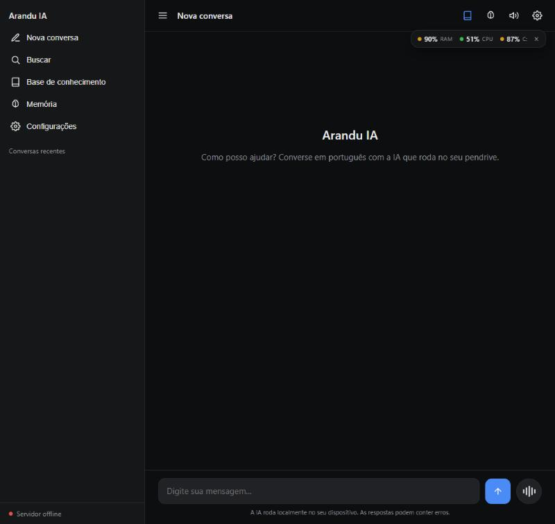
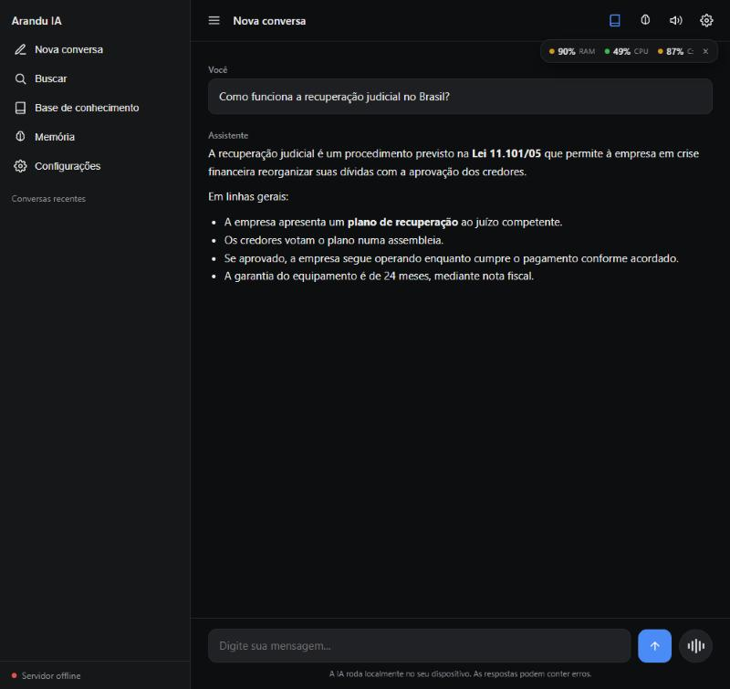
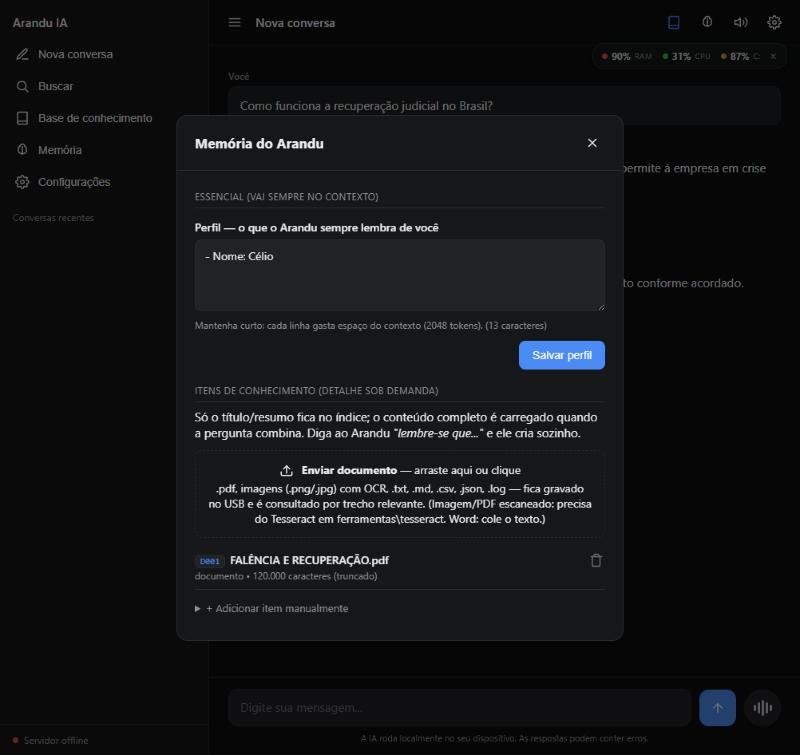
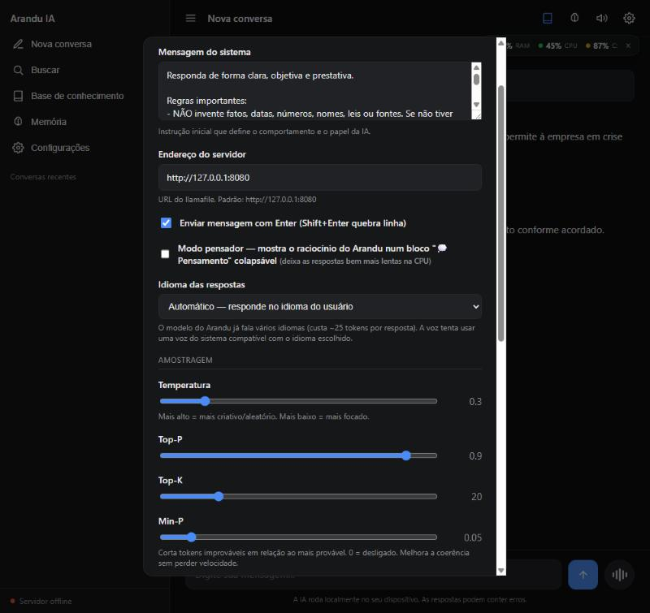

# 📖 Rendeia — Manual de uso

<p align="center">
  <strong>Manual completo de instalação, configuração e uso da Rendeia.</strong><br>
  IA conversacional 100% offline, em português, na CPU, direto do pendrive.
</p>

<p align="center">
  🇧🇷 <a href="#-rendeia--manual-pt-br">Português (Brasil)</a> · 🇺🇸 <a href="#-rendeia--user-manual-english">English</a>
</p>

---

# 🇧🇷 Rendeia — Manual (pt-BR)

> Este manual cobre desde a primeira execução até as funções avançadas. Se você é
> só **testador** e quer ir direto, leia o [GUIA_DO_TESTADOR.md](../GUIA_DO_TESTADOR.md)
> (3 minutos). Se você é **desenvolvedor** querendo entender a arquitetura, comece
> pelo [PLANO.md](PLANO.md).

## Sumário

1. [O que é a Rendeia](#1-o-que-é-a-rendeia)
2. [Instalação](#2-instalação)
3. [Primeira execução](#3-primeira-execução)
4. [Conversando — uso básico](#4-conversando--uso-básico)
5. [Memória — ensinando a Rendeia](#5-memória--ensinando-a-rendeia)
6. [Upload de documentos (PDF, imagens, texto)](#6-upload-de-documentos)
7. [Base de conhecimento (RAG)](#7-base-de-conhecimento-rag)
8. [Voz (TTS)](#8-voz-tts)
9. [Multilíngue](#9-multilíngue)
10. [Modo pensador](#10-modo-pensador)
11. [Assistente do sistema (saúde, agenda, e-mail)](#11-assistente-do-sistema)
12. [OCR — Tesseract (opcional)](#12-ocr--tesseract)
13. [Configurações avançadas](#13-configurações-avançadas)
14. [Solução de problemas](#14-solução-de-problemas)
15. [Privacidade e segurança](#15-privacidade-e-segurança)
16. [Para desenvolvedores](#16-para-desenvolvedores)
17. [Licenças e créditos](#17-licenças-e-créditos)

---

## 1. O que é a Rendeia

O **Arandu** é um assistente de IA que roda **100% no seu computador**, sem
internet, sem instalar nada, direto de um pendrive (ou pasta local). Conversa em
português do Brasil; também responde em inglês, espanhol, francês e alemão.

**O nome.** *Arandu* vem do tupi-guarani: **Ára** (tempo/cosmos) + **Andu**
(sentir/ouvir) = *sabedoria*.

### O que ele faz bem

- Conversa de uso geral: resumos, redação, tradução, dúvidas do dia a dia.
- Aprende com o uso: você ensina ("lembre-se que…") e ele guarda no USB.
- Lê documentos que você envia (PDF com texto, imagens via OCR, .txt/.md/.csv).
- Vê a saúde do seu PC (RAM, disco, CPU) e a agenda/e-mails do Outlook local
  *(somente leitura; nunca apaga nem envia nada)*.

### O que ele **não** faz

- Não pesquisa na internet — é offline por escolha.
- Não é especialista (modelo de 1,7 B): pode errar fatos e raciocínios
  complexos. Para conhecimento factual, use a memória ou o RAG.
- Não escreve código avançado nem faz matemática pesada.

### Requisitos mínimos

| | Windows | Linux | macOS |
|---|---|---|---|
| Sistema | 10 ou 11 | distro recente | recente |
| RAM | **2 GB livres** | 2 GB livres | 2 GB livres |
| Espaço | ~1,5 GB | ~1,5 GB | ~1,5 GB |
| GPU | **dispensável** (roda só na CPU) | dispensável | dispensável |
| Navegador | Edge, Chrome, Firefox | qualquer | Safari, Chrome, Firefox |

---

## 2. Instalação

### 2.1 Caminho fácil: pacote pronto (Windows)

1. Baixe o `.zip` em [Releases](https://github.com/rendeia/arandu_nano/releases/latest).
2. **Extraia** numa pasta qualquer (Área de Trabalho, pendrive…).
3. Abra a pasta — você verá `IA_Portatil.vbs` e `Iniciar_Arandu.vbs`.

Não há instalador. Para remover, é só apagar a pasta.

### 2.2 A partir do código (qualquer SO)

```sh
git clone https://github.com/rendeia/arandu_nano.git
cd arandu_nano
```

Depois você precisa baixar à parte (não vão no Git por causa do tamanho):

1. **Motor** — `llamafile.exe` (~320 MB):
   <https://github.com/Mozilla-Ocho/llamafile/releases> · renomeie para
   `llamafile.exe` e coloque na raiz do projeto.

2. **Modelo** — escolha um GGUF Q4_K_M e coloque na raiz:
   - **Arandu Mirim 1.1** (recomendado, pt-BR otimizado) —
     [baixar no Hugging Face](https://huggingface.co/celionormando/Arandu-Nano-1.1-GGUF)
     *(o repo mantém o nome legado `Arandu-Nano-1.1-GGUF` por compatibilidade; o modelo
     é o Arandu Mirim 1.1 da nomenclatura atual)*
   - Alternativas para comparar: Llama-3.2-1B/3B em
     [bartowski no Hugging Face](https://huggingface.co/bartowski)

3. **Edite `modelo.txt`** com o nome exato do `.gguf` baixado (uma linha só).

### 2.3 Windows corporativo (AppLocker bloqueou o `.exe`)

Se o Windows recusa o `llamafile.exe` com "Permissão negada" (o llamafile é um
binário APE, que algumas políticas bloqueiam), use o **llama.cpp comum**:

1. Baixe o asset `win-cpu-x64` em
   <https://github.com/ggml-org/llama.cpp/releases>.
2. Extraia em uma pasta chamada `llama/` na raiz do projeto.
3. O `IA_Portatil.vbs` **detecta** o `llama/llama-server.exe` e usa
   automaticamente (é um `.exe` normal, passa no AppLocker).

### 2.4 Linux / macOS

```sh
chmod +x iniciar.sh desligar.sh
./iniciar.sh         # sobe o motor + abre o navegador
./desligar.sh        # encerra
```

> Os `.sh` precisam de fim de linha **LF** (CRLF quebra o shebang). O
> `.gitattributes` já força isso ao clonar.

---

## 3. Primeira execução

1. **Windows:** duplo clique em `IA_Portatil.vbs` (ou `Iniciar_Arandu.vbs`).
   **Linux/macOS:** `./iniciar.sh`.
2. Aguarde **10 a 40 segundos** na primeira vez — o modelo está carregando na
   RAM. Não aparece janela preta (é proposital).
3. O **navegador abre sozinho** com a tela do chat. Digite e pergunte.



### Sinais de "está tudo bem"

- No canto inferior esquerdo da barra lateral, **"Conectado · Arandu Mirim 1.1"**
  com bolinha verde.
- No canto superior direito do chat, um **mini-painel** com RAM, CPU e disco
  (sinal de que o ajudante está no ar).

### O que faz o pacote ser tão leve

- O motor (`llamafile`) é **um único `.exe`** — sem instalador, sem dependências.
- O servidor "dorme" após **3 minutos parado**, liberando RAM. A próxima
  pergunta acorda em ~2 segundos. Útil quando você fecha o navegador e esquece.

---

## 4. Conversando — uso básico

A interface é familiar: barra lateral com **conversas recentes**, topo com
**título** e ícones, centro com o **chat**, embaixo um **campo de mensagem**.



### Atalhos úteis

| Ação | Como |
|---|---|
| Enviar mensagem | **Enter** (pode trocar para Ctrl+Enter nas configurações) |
| Quebrar linha | **Shift + Enter** |
| Parar a resposta | Clique no botão de **■** (vira "stop" enquanto o modelo escreve) |
| Nova conversa | Botão **"Nova conversa"** na barra lateral |
| Buscar nas conversas | Botão **"Buscar"** na barra lateral |
| Esconder a barra lateral | Ícone de menu (☰) no topo |

### O hint de "pensando"

Enquanto a primeira palavra ainda não chega, aparecem frases rotativas tipo
*"Arandu está filosofando…"* ou *"Ouvindo o conselho dos antigos…"*. É um
indicador visual — significa que o modelo está processando. Quando o texto real
começa, a frase é substituída.

### O que esperar de qualidade

O Arandu Mirim 1.1 é um modelo **pequeno** (1,7 bilhão de parâmetros). Acerta
muito em conversas comuns, mas:

- Pode errar **fatos específicos** (datas, números, leis, nomes). Para isso,
  use a [memória](#5-memória--ensinando-o-arandu) ou o [RAG](#7-base-de-conhecimento-rag).
- Pode misturar idiomas em respostas longas (vaza inglês/espanhol). O sistema
  tem correções automáticas para os erros mais comuns.
- Não é bom para código complexo ou matemática avançada.

---

## 5. Memória — ensinando a Rendeia

A Rendeia **aprende com você** e guarda tudo **no pendrive**, em `memoria/`.
Privado, fora do Git por padrão.

A memória tem 3 camadas:

| Camada | Onde | Para quê |
|---|---|---|
| **Perfil** | `memoria/perfil.md` | O essencial sobre você (nome, preferências). Vai **sempre** no contexto. |
| **Índice** | `memoria/indice.json` | Lista curta de itens (id, título, palavras-chave). Vai **sempre** no contexto. |
| **Itens** | `memoria/itens/<id>.md` | Detalhe completo de cada item. Carregado **só quando a pergunta combina**. |

### Como ensinar (jeito automático)

Diga à Rendeia coisas como:

- *"Meu nome é Célio."*
- *"Lembre-se que a reunião com a equipe é toda terça às 10h."*
- *"Anote que minha senha do wifi é girassol-2026."*
- *"Memorize que o prazo do contrato termina em 30 de outubro."*

Ele detecta esses padrões (em pt/en/es/fr/de) e grava no USB. Aparece um
**toast** de confirmação no canto inferior.

### Como ensinar (jeito manual)

Clique em **"Memória"** na barra lateral. Você pode:

- **Editar o perfil** diretamente (texto livre).
- **Adicionar um item** clicando em "+ Adicionar item manualmente".
- **Remover** qualquer item com o ícone de lixeira.



### Como a Rendeia consulta a memória

A cada pergunta:

1. O **perfil** e o **índice** vão no contexto (custo: ~30-50 palavras).
2. Se a pergunta casa com algum item, o **detalhe** desse item é incluído.
3. No próximo turno, o detalhe sai do contexto (libera espaço).

Isso permite acumular muitos documentos sem estourar os **2048 tokens** de
contexto do modelo.

> **Por que isso é diferente do RAG?** O RAG usa um segundo modelo (embeddings,
> ~437 MB extras na RAM) e busca por similaridade semântica. A memória usa só
> palavras-chave e pesa quase nada. Bom para a maioria dos casos; o RAG continua
> útil quando você precisa de busca semântica em corpus muito grande.

---

## 6. Upload de documentos

No painel **Memória**, há uma área **"Enviar documento — arraste aqui ou clique"**.

### Formatos aceitos

| Tipo | Como funciona |
|---|---|
| **PDF** com texto | Lido offline pelo **pdf.js** (carregado só quando chega um PDF). |
| **PDF escaneado** ou **imagem** (PNG, JPG, WebP, BMP, TIFF, GIF) | Precisa do **[Tesseract](#12-ocr--tesseract)** instalado. |
| **Texto** (`.txt`, `.md`, `.csv`, `.json`, `.log`) | Lido direto. |
| Word, Excel, PowerPoint | Não suportado *ainda* — cole o texto manualmente. |

### O que acontece quando você envia um documento

1. O texto é extraído (pdf.js, OCR ou leitura direta).
2. Vira um **item** no USB (`memoria/itens/D001.md` etc.).
3. Palavras-chave são extraídas (até 40, só para roteamento — não pesam no
   prompt).
4. Na sua próxima pergunta, se ela casar com o documento, **só o trecho
   relevante** é injetado no contexto.

### Limites

- Tamanho máximo por arquivo: ~120.000 caracteres (truncado se passar).
- Termo muito raro num documento grande pode não ser roteado pelo índice de
  palavras — nesse caso o RAG por embeddings é mais robusto.

> 📎 **Quer testar?** Baixe o [PDF de exemplo](exemplo-memoria.pdf), arraste no
> painel **Memória** da Rendeia e faça perguntas sobre o conteúdo.

---

## 7. Base de conhecimento (RAG)

O RAG é a camada **opcional** para busca **semântica** (não só por palavras) em
documentos. Recomendado quando a memória (item 5) não é suficiente.

### Para ligar

1. Baixe `bge-m3-Q4_K_M.gguf` (~437 MB) do repo `gpustack/bge-m3-GGUF` e
   coloque em `rag/`.
2. Inicie pelo **`IA_Arandu_RAG.vbs`** (Windows) ou **`./iniciar_rag.sh`**
   (Linux/macOS).
3. No chat, abra **Base de conhecimento**, cole/envie textos, clique em
   **Indexar**.
4. Ligue o RAG no botão da barra de cima (📖).

### Modo estrito

Por padrão, a Rendeia responde **somente** com base nos trechos da base de
conhecimento — se o tema não está coberto, ele diz *"Não encontrei isso na
base de conhecimento"* em vez de inventar. Pode desligar nas Configurações da
base se preferir.

### Custo

- **+437 MB de RAM** (modelo bge-m3 vivo).
- **+200-500 tokens** no contexto a cada pergunta.
- Por isso o RAG é **sob demanda** — não está no modo padrão.

---

## 8. Voz (TTS)

Clique no ícone 🔊 no topo do chat para ligar/desligar a voz.

### Duas vozes possíveis

| Voz | Como | Qualidade | Idiomas |
|---|---|---|---|
| **Piper** (neural, offline) | Precisa de `ferramentas/piper/` instalado (passo abaixo) | Mais natural | só pt-BR por padrão |
| **Web Speech** (do sistema) | Sempre disponível, usa a voz do SO | Variável (depende da voz do SO) | qualquer instalado no SO |

O chat prefere o Piper, e cai automaticamente na Web Speech se o Piper não
estiver instalado.

### Instalar a voz Piper (Windows)

1. Baixe `piper_windows_amd64.zip` em
   <https://github.com/rhasspy/piper/releases> e extraia em
   `ferramentas/piper/`.
2. Baixe a voz `pt_BR-faber-medium.onnx` + `.onnx.json` em
   <https://huggingface.co/rhasspy/piper-voices/tree/main/pt/pt_BR/faber/medium>
   e coloque na mesma pasta.

Resultado: `ferramentas/piper/` com `piper.exe`, `onnxruntime.dll`, a voz `.onnx`/`.json`
e a pasta `espeak-ng-data/`.

### Sintomas e correções

- **Letra solta lida estranho** (ex.: "D." virou "QUÊ"): já corrigido — agora o
  chat manda a pronúncia correta ("dê,").
- **Voz "engole" sílabas** em palavras longas: limitação do modelo Piper
  `pt_BR-faber-medium`. Alternativas: vozes `cadu` ou `jeff` (mesmo repo).

---

## 9. Multilíngue

O modelo Qwen3-1.7B já é multilíngue de fábrica — **zero RAM extra**. Custa
~25 tokens no prompt para "trancar" o idioma.

### Como mudar

**Configurações → Idioma das respostas:**

| Opção | Comportamento |
|---|---|
| **Automático** (padrão) | Responde no idioma da pergunta |
| **Português (pt-BR)** | Sempre responde em pt-BR |
| English / Español / Français / Deutsch | Fixos |

### Comandos de memória multilíngue

A captura automática reconhece equivalentes:

| pt-BR | en | es | fr | de |
|---|---|---|---|---|
| meu nome é / me chamo | my name is / call me | me llamo / mi nombre es | je m'appelle | ich heisse / mein name ist |
| lembre-se que / anote que | remember that / note that | recuerda que | souviens-toi que | merke dir, dass |

### Voz por idioma

Quando você muda o idioma, o sistema tenta usar uma voz do SO com o **BCP-47**
correspondente (`en-US`, `es-ES`, `fr-FR`, `de-DE`). Se não houver, cai em
pt-BR. O Piper só tem pt-BR; idiomas estrangeiros usam Web Speech.

---

## 10. Modo pensador

Em **Configurações**, há o toggle **"Modo pensador"** (desligado por padrão).

Quando ligado, remove a instrução `/no_think` do Qwen3. O modelo **pensa antes
de responder** e o raciocínio aparece num bloco colapsável **"💭 Pensamento"**
no início da resposta (clique para abrir).

> ⚠️ **Custa velocidade.** As respostas ficam **bem mais lentas** na CPU porque
> o modelo gera muito mais tokens (o pensamento). Use quando quiser entender
> *como* ele chegou na resposta — não no dia a dia.

---

## 11. Assistente do sistema

A Rendeia enxerga o seu PC — **somente leitura**.

| Função | Windows | Linux | macOS |
|---|:---:|:---:|:---:|
| Saúde (RAM/CPU/disco) | ✅ | ✅ | ✅ |
| Limpeza (lista o que pode liberar) | ✅ | ✅ | ✅ |
| Agenda (Outlook local) | ✅ | 🔜 | 🔜 |
| E-mail (Outlook local, só metadados) | ✅ | 🔜 | 🔜 |

### Mini-painel de saúde

Aparece sozinho no canto superior direito do chat (quando o ajudante está no
ar). Mostra RAM, CPU e disco com cores: verde (ok), amarelo (atenção),
vermelho (crítico).

### Painel completo (`Painel_Saude.vbs`)

Duplo clique em `Painel_Saude.vbs` abre uma página separada com os medidores
detalhados, a lista de **arquivos limpáveis** (com tamanho), a **agenda dos
próximos 14 dias** e os **e-mails recentes**.

Os botões **"Pedir análise / Resumir com a Rendeia"** enviam os dados para o
modelo, que devolve um resumo em português. **Os números vêm sempre do
código** — o modelo só narra (à prova de alucinação).

### Princípio

> A Rendeia **mede e sugere; nunca apaga**. Toda exclusão é decidida e
> confirmada por você. O ajudante só escuta em `127.0.0.1` (não acessível
> pela rede).

Detalhes técnicos em [`ferramentas/README.md`](../ferramentas/README.md).

---

## 12. OCR — Tesseract

Opcional. Necessário só se você quer enviar **imagens** ou **PDFs escaneados**.

### Instalar (Windows)

1. Baixe o instalador do Tesseract OCR (ex.: build do UB Mannheim):
   <https://github.com/UB-Mannheim/tesseract/wiki>
2. Pegue a versão **portátil** (ou instale e copie a pasta `Tesseract-OCR`).
3. Coloque os arquivos em `ferramentas/tesseract/` de forma que existam:
   - `ferramentas/tesseract/tesseract.exe`
   - `ferramentas/tesseract/tessdata/por.traineddata`
   - `ferramentas/tesseract/tessdata/eng.traineddata` (opcional)

### Verificar

Ao enviar uma imagem no painel **Memória**, se aparecer *"OCR indisponível —
instale o Tesseract"*, é porque a pasta acima não foi montada corretamente.

### Como funciona

1. Imagem é enviada para a rota `/ocr` do ajudante (porta 8099).
2. Ajudante chama o `tesseract.exe` localmente.
3. Texto extraído entra na memória como um item normal.

> **Por que Tesseract e não o `baidu/Unlimited-OCR`?** O Unlimited-OCR tem
> 6,78 GB e exige GPU + CUDA — fora das premissas do projeto (CPU, USB, RAM
> apertada). O Tesseract pesa ~40 MB, roda em CPU e é maduro.

---

## 13. Configurações avançadas

Botão de engrenagem ⚙️ no topo.



### Geral

| Campo | O que faz | Quando alterar |
|---|---|---|
| Mensagem do sistema | Instrução base para a IA | Para mudar o "papel" da IA |
| Endereço do servidor | Onde o llamafile está rodando | Raramente (default `127.0.0.1:8080`) |
| Enviar com Enter | Tecla de envio | Preferência |
| **Modo pensador** | Mostra o raciocínio | Quando quer ver "como" pensou |
| **Idioma das respostas** | Trava ou auto-detecta | Quando quer fixar o idioma |

### Amostragem

| Parâmetro | Default | Para quê |
|---|---|---|
| Temperatura | 0.3 | Mais alto = mais criativo. Mais baixo = mais factual. |
| Top-P | 0.9 | Limita o vocabulário (nucleus sampling) |
| Top-K | 20 | Limita o nº de tokens candidatos |
| Min-P | 0.05 | Descarta tokens muito improváveis |
| Repeat penalty | 1.1 | Reduz repetição |
| Max tokens | 512 | Tamanho máximo da resposta |
| DRY multiplier | 0.8 | Anti-repetição mais inteligente |

**Quando mexer:**

- Respostas muito criativas/inventadas → reduzir temperatura para 0.1-0.2.
- Respostas robotizadas/repetitivas → aumentar temperatura para 0.5-0.7 e
  repeat penalty para 1.15.
- Respostas curtas demais → aumentar max tokens.

### Trocar de modelo

Edite `modelo.txt` (uma linha com o nome do `.gguf`). Reinicie pelo `.bat`
correspondente:

| Arquivo | Modelo | Geração |
|---|---|---|
| `Usar_Nano_1.1.bat` | Arandu Mirim 1.1 (Qwen3-1.7B + imatrix, Q4_K_M) — padrão | G1 |
| `Usar_Nano_Q4_0.bat` | Arandu Mirim 1.1 Q4_0 — **15-25% mais rápido em CPUs com AVX2/AVX-512** | G1 |
| `Usar_Nano_1.0.bat` | Arandu Mirim 1.0 (Llama-1B fine-tune próprio) | G1 |
| `Usar_1B_Rapido.bat` | Llama-3.2-1B base | — |
| `Usar_3B_Qualidade.bat` | Llama-3.2-3B base (mais lento, mais qualidade) | — |

> 🧠 **Família Katu (G2 — Raciocínio)** vive em repo próprio:
> [**rendeia/Katu**](https://github.com/rendeia/Katu). Lá você encontra o
> `Usar_Katu_Mirim.bat`, o passo a passo de integração e os links pros `.gguf`.
> Modelos da família Katu pensam antes de responder (geram `<think>` interno).
> Coexiste com Arandu — integração leva ~5 min.

> **Quer a variante Q4_0?** Gere com:
> ```powershell
> PowerShell -ExecutionPolicy Bypass -File treino\imatrix\regenerar_nano_q4_0.ps1
> ```
> O script verifica seu CPU e avisa o ganho esperado. Qualidade fica
> ligeiramente menor (~3-5% pior perplexidade) — vale o teste pra ver se
> compensa. Detalhes em [`treino/imatrix/README.md`](../treino/imatrix/README.md).

---

## 14. Solução de problemas

### O navegador não abriu

Aguarde até **40 segundos** na primeira execução. Se não abrir, abra o
`chat.html` manualmente (duplo clique) — o motor pode já estar no ar.

### "Não consegui iniciar o servidor"

- Verifique se o `llamafile.exe` foi **desbloqueado** (botão direito → Propriedades → marcar
  "Desbloquear" → OK).
- Se o antivírus bloqueou: adicione a pasta da Rendeia como exceção.
- Se o AppLocker bloqueou: use a alternativa do `llama-server.exe` (veja [§ 2.3](#23-windows-corporativo-applocker-bloqueou-o-exe)).
- Se nada funcionar, rode pelo WSL Ubuntu: `./iniciar.sh`.

### Está lento

Normal em PCs antigos. A 1ª resposta após uma pausa é a mais lenta. Para
ganhos reais:

- Use o **Arandu Mirim 1.1** (padrão) em vez do 3B.
- Verifique que a configuração tem `-t 3` (3 threads — testado como ideal
  para 4 cores).
- Desligue o **Modo pensador** se estiver ligado.

> ⚡ **Prompt caching (v1.3+):** os lançadores já passam `--cache-reuse 256` e
> `--slot-save-path cache/` ao servidor. A pasta `cache/` é criada
> automaticamente no primeiro uso e persiste o estado entre reinícios. A 2ª
> pergunta em diante (e principalmente após o servidor "acordar" do modo de
> economia) fica perceptivelmente mais rápida.

### A voz fala estranho

- Verifique se o Piper está em `ferramentas/piper/` (veja [§ 8](#8-voz-tts)).
- Se persiste, é limitação do modelo `pt_BR-faber-medium`. Experimente trocar
  para `cadu` ou `jeff` no mesmo repositório de vozes.

### Aparece "[ D001 ]" na resposta

Não deveria mais aparecer (já corrigido). Se aparecer: atualize o
`chat.html` para a versão mais nova do GitHub.

### Mistura idiomas ("any", "habilitación", "après")

Já tem correção automática para os casos mais comuns. Se aparecer um novo:
abra uma issue com o exemplo. Para reduzir: em **Configurações → Idioma**,
escolha **Português (pt-BR)** em vez de **Automático**.

### A memória "não funciona" (modelo diz que não sabe)

- Verifique se o documento aparece no painel **Memória**.
- Se a pergunta é muito **genérica** ("o que você sabe sobre X") num documento
  grande sobre X, o trecho selecionado é a **introdução** do documento (essa é
  a heurística certa). Tente perguntas mais específicas.
- Se o tema do documento usa um **termo raro**, pode não casar com o índice.
  Nesse caso ligue o RAG ([§ 7](#7-base-de-conhecimento-rag)).

### O Tesseract não foi detectado

Confira o caminho exato: `ferramentas/tesseract/tesseract.exe` e
`ferramentas/tesseract/tessdata/por.traineddata`. Sem essa estrutura, a rota
`/ocr` devolve 503.

---

## 15. Privacidade e segurança

- **Nada sai do seu PC.** A Rendeia roda local. Nenhuma chamada à internet é
  feita pelo motor (`llamafile`) nem pelo ajudante.
- **Memória no USB.** A pasta `memoria/` fica no próprio pendrive/pasta —
  privada, fora do Git por padrão.
- **Ajudante só local.** O serviço da porta `8099` escuta em `127.0.0.1`
  (loopback) — não é acessível pela rede.
- **Outlook só leitura.** Quando você usa agenda/e-mail, só **metadados** são
  lidos (assunto, remetente, data, horário). **O conteúdo das mensagens não
  é aberto.**
- **Nunca apaga.** Para limpeza de arquivos, a Rendeia **mede e sugere; você
  decide e confirma.**

### Onde ficam os seus dados

| Dado | Onde |
|---|---|
| Histórico de conversas | `localStorage` do navegador (do perfil que abriu o `chat.html`) |
| Perfil da Rendeia sobre você | `memoria/perfil.md` (no USB) |
| Itens/documentos enviados | `memoria/itens/<id>.md` (no USB) |
| Base de conhecimento (RAG) | `IndexedDB` do navegador |
| Configurações | `localStorage` do navegador |

### Para apagar tudo

Apague a pasta `memoria/` (e, no navegador, limpe os dados do site `chat.html`
em "Configurações → Privacidade").

---

## 16. Para desenvolvedores

| Doc | Para quê |
|---|---|
| [PLANO.md](PLANO.md) | Visão técnica completa do projeto |
| [ferramentas/README.md](../ferramentas/README.md) | Arquitetura do ajudante (porta 8099) |
| [treino/README.md](../treino/README.md) | Fine-tuning no Colab |
| [treino/imatrix/README.md](../treino/imatrix/README.md) | Re-quantização com imatrix pt-BR |
| [NOMENCLATURA_MODELOS.md](NOMENCLATURA_MODELOS.md) | Convenção de nomes (Arandu/Katu/Vera/Taba) |

### Empacotar uma release

```powershell
powershell -ExecutionPolicy Bypass -File empacotar.ps1            # leve (sem RAG)
powershell -ExecutionPolicy Bypass -File empacotar.ps1 -ComRAG    # completo (com RAG)
```

---

## 17. Licenças e créditos

O código da **Rendeia** (interface, lançadores, scripts, RAG) é distribuído sob
a licença **Apache-2.0** — veja [`LICENSE`](../LICENSE).

| Componente | Autor | Licença |
|---|---|---|
| **llamafile** (motor) | Mozilla Ocho | Apache-2.0 |
| **Qwen3-1.7B** (modelo padrão) | Alibaba Cloud | Apache-2.0 |
| **bge-m3** (RAG opcional) | BAAI | MIT |
| **Llama 3.2** (modelos base opcionais) | Meta | Llama 3.2 Community License |
| **Piper TTS** (voz neural) | Rhasspy | MIT |
| **Tesseract** (OCR opcional) | Google/UB Mannheim | Apache-2.0 |
| **pdf.js** (leitura PDF) | Mozilla | Apache-2.0 |

> Os pesos da **Llama 3.2** têm licença própria da Meta (com restrições de uso);
> por isso o pacote padrão usa o **Qwen3** (Apache-2.0), de redistribuição livre.

---

<p align="center"><a href="#-arandu-ia--manual-de-uso">⬆ topo</a></p>

---

# 🇺🇸 Rendeia — User Manual (English)

> This manual covers Rendeia from first run to advanced features. If you're
> just **testing**, jump to [GUIA_DO_TESTADOR.md](../GUIA_DO_TESTADOR.md)
> (3 minutes, Portuguese). If you're a **developer**, start with
> [PLANO.md](PLANO.md).

## Table of contents

1. [What is Rendeia](#1-what-is-rendeia)
2. [Installation](#2-installation-1)
3. [First run](#3-first-run)
4. [Chatting — basic use](#4-chatting--basic-use)
5. [Memory — teaching Rendeia](#5-memory--teaching-rendeia)
6. [Document upload (PDF, images, text)](#6-document-upload)
7. [Knowledge base (RAG)](#7-knowledge-base-rag)
8. [Voice (TTS)](#8-voice-tts)
9. [Multilingual](#9-multilingual)
10. [Thinker mode](#10-thinker-mode)
11. [System assistant (health, calendar, e-mail)](#11-system-assistant)
12. [OCR — Tesseract (optional)](#12-ocr--tesseract-1)
13. [Advanced settings](#13-advanced-settings)
14. [Troubleshooting](#14-troubleshooting)
15. [Privacy and security](#15-privacy-and-security)
16. [For developers](#16-for-developers)
17. [Licenses and credits](#17-licenses-and-credits)

---

## 1. What is Rendeia

**Arandu** is an AI assistant that runs **100% on your machine**, no internet,
no installation, straight from a USB stick (or local folder). Optimized for
Brazilian Portuguese; also speaks English, Spanish, French, and German.

**The name.** *Arandu* comes from Tupi-Guarani: **Ára** (time/cosmos) +
**Andu** (feel/listen) = *wisdom*.

### What it does well

- General conversation: summaries, writing, translation, everyday questions.
- Learns from use: tell it *"remember that…"* and it stores on your USB.
- Reads documents you upload (PDF with text, images via OCR, .txt/.md/.csv).
- Sees your PC's health (RAM/disk/CPU) and your local Outlook calendar/email
  *(read-only; never deletes or sends anything)*.

### What it does **not** do

- No internet search — offline by design.
- Not a specialist (1.7 B model): may get facts and complex reasoning wrong.
  For factual knowledge, use the memory or the RAG.
- No advanced coding nor heavy math.

### Minimum requirements

| | Windows | Linux | macOS |
|---|---|---|---|
| OS | 10 or 11 | recent distro | recent |
| RAM | **2 GB free** | 2 GB free | 2 GB free |
| Disk | ~1.5 GB | ~1.5 GB | ~1.5 GB |
| GPU | **not needed** (CPU only) | not needed | not needed |
| Browser | Edge, Chrome, Firefox | any | Safari, Chrome, Firefox |

---

## 2. Installation

### 2.1 Easy path: ready-made package (Windows)

1. Download the `.zip` from [Releases](https://github.com/rendeia/arandu_nano/releases/latest).
2. **Extract** to any folder (Desktop, USB stick…).
3. Open the folder — you'll see `IA_Portatil.vbs` and `Iniciar_Arandu.vbs`.

No installer. To uninstall, just delete the folder.

### 2.2 From source (any OS)

```sh
git clone https://github.com/rendeia/arandu_nano.git
cd arandu_nano
```

Then download separately (not in Git due to size):

1. **Engine** — `llamafile.exe` (~320 MB):
   <https://github.com/Mozilla-Ocho/llamafile/releases>. Rename to
   `llamafile.exe` and place at the project root.

2. **Model** — pick a GGUF Q4_K_M and place at the root:
   - **Arandu Mirim 1.1** (recommended, pt-BR optimized) —
     [download on Hugging Face](https://huggingface.co/celionormando/Arandu-Nano-1.1-GGUF)
     *(the repo keeps the legacy name `Arandu-Nano-1.1-GGUF` for compatibility;
     the model itself is Arandu Mirim 1.1 in the current naming)*
   - Alternatives: Llama-3.2-1B/3B at
     [bartowski on Hugging Face](https://huggingface.co/bartowski)

3. **Edit `modelo.txt`** with the exact `.gguf` filename (single line).

### 2.3 Corporate Windows (AppLocker blocks .exe)

If Windows refuses `llamafile.exe` with "Access denied" (llamafile is an APE
binary, blocked by some policies), use the **standard llama.cpp**:

1. Download the `win-cpu-x64` asset from
   <https://github.com/ggml-org/llama.cpp/releases>.
2. Extract to a folder named `llama/` at the project root.
3. `IA_Portatil.vbs` **auto-detects** `llama/llama-server.exe` (a regular
   `.exe`, AppLocker-compatible).

### 2.4 Linux / macOS

```sh
chmod +x iniciar.sh desligar.sh
./iniciar.sh         # starts engine + opens browser
./desligar.sh        # shuts down
```

> The `.sh` files need **LF** line endings (CRLF breaks the shebang on Linux).
> `.gitattributes` already enforces this on clone.

---

## 3. First run

1. **Windows:** double-click `IA_Portatil.vbs` (or `Iniciar_Arandu.vbs`).
   **Linux/macOS:** `./iniciar.sh`.
2. Wait **10–40 seconds** on first run — the model is loading into RAM. No
   black window appears (by design).
3. The **browser opens automatically** with the chat. Type and ask.


### Signs everything's fine

- Bottom of the sidebar: **"Conectado · Arandu Mirim 1.1"** with a green dot.
- Top right of the chat: a **mini-panel** with RAM, CPU, and disk (means the
  helper is up).

### What makes the package so light

- The engine (`llamafile`) is **a single `.exe`** — no installer, no
  dependencies.
- The server **sleeps after 3 idle minutes**, releasing RAM. The next message
  wakes it in ~2 seconds.

---

## 4. Chatting — basic use

Familiar layout: sidebar with **recent conversations**, top bar with **title**
and icons, center is the **chat**, bottom is the **message field**.


### Useful shortcuts

| Action | How |
|---|---|
| Send message | **Enter** (can switch to Ctrl+Enter in settings) |
| Line break | **Shift + Enter** |
| Stop generation | Click the **■** button |
| New conversation | **"Nova conversa"** in sidebar |
| Search conversations | **"Buscar"** in sidebar |
| Hide sidebar | Menu icon (☰) at the top |

### The "thinking" hint

Until the first word arrives, rotating phrases like *"Arandu está
filosofando…"* appear. It's a visual indicator — the model is processing.
When the actual text starts, the phrase is replaced.

### Quality expectations

Arandu Mirim 1.1 is a **small** model (1.7 billion parameters). Solid for
everyday conversation, but:

- May get **specific facts wrong** (dates, numbers, laws, names). For that,
  use the [memory](#5-memory--teaching-rendeia) or the [RAG](#7-knowledge-base-rag).
- May mix languages in long answers. The system has automatic corrections for
  the most common cases.
- Not good for complex code or advanced math.

---

## 5. Memory — teaching Rendeia

Arandu **learns from you** and saves everything **on the USB**, in `memoria/`.
Private, outside of Git by default.

Three layers:

| Layer | Where | For what |
|---|---|---|
| **Profile** | `memoria/perfil.md` | The essentials about you. **Always** in context. |
| **Index** | `memoria/indice.json` | Short list of items (id, title, keywords). **Always** in context. |
| **Items** | `memoria/itens/<id>.md` | Full content of each item. Loaded **only when relevant**. |

### Teaching (automatic)

Just say things like:

- *"My name is Sarah."*
- *"Remember that the team meeting is every Tuesday at 10 AM."*
- *"Note that my wifi password is sunflower-2026."*

It detects these patterns (in pt/en/es/fr/de) and saves to the USB. A
confirmation **toast** appears at the bottom.

### Teaching (manual)

Click **"Memória"** in the sidebar. You can:

- **Edit the profile** directly (free text).
- **Add an item** via "+ Adicionar item manualmente".
- **Remove** any item with the trash icon.


### How Rendeia uses the memory

Per question:

1. **Profile** and **index** go into context (cost: ~30-50 words).
2. If the question matches an item, that item's **content** is included.
3. On the next turn, the content leaves the context (frees space).

This lets you accumulate many documents without blowing the **2048-token**
model context.

> **How is this different from RAG?** RAG uses a second model (embeddings,
> ~437 MB extra in RAM) and searches by semantic similarity. Memory uses just
> keywords and weighs almost nothing. Good for most cases; RAG still helps when
> you need semantic search over a very large corpus.

---

## 6. Document upload

In the **Memória** panel, drop files in *"Enviar documento — arraste aqui ou clique"*.

### Accepted formats

| Type | How it works |
|---|---|
| **PDF** with text | Read offline via **pdf.js** (loaded only when a PDF arrives). |
| **Scanned PDF** or **image** (PNG, JPG, WebP, BMP, TIFF, GIF) | Needs **[Tesseract](#12-ocr--tesseract-1)** installed. |
| **Text** (`.txt`, `.md`, `.csv`, `.json`, `.log`) | Read directly. |
| Word, Excel, PowerPoint | Not yet supported — paste the text manually. |

### What happens on upload

1. Text is extracted (pdf.js, OCR, or direct read).
2. Becomes an **item** on the USB (`memoria/itens/D001.md` etc.).
3. Keywords are extracted (up to 40, routing only — don't weigh on the prompt).
4. On your next question, if it matches the document, **only the relevant
   excerpt** is injected into context.

### Limits

- Max per file: ~120,000 characters (truncated above).
- Very rare terms in large documents may not match the keyword index — RAG
  with embeddings is more robust for that.

> 📎 **Want to try?** Download the [sample PDF](exemplo-memoria.pdf), drop it
> into the **Memória** panel and ask questions about its content.

---

## 7. Knowledge base (RAG)

RAG is the **optional** layer for **semantic** search (not just keywords) in
documents. Use when the memory (§ 5) isn't enough.

### To enable

1. Download `bge-m3-Q4_K_M.gguf` (~437 MB) from `gpustack/bge-m3-GGUF` and
   place in `rag/`.
2. Start via **`IA_Arandu_RAG.vbs`** (Windows) or **`./iniciar_rag.sh`**
   (Linux/macOS).
3. In the chat, open **Base de conhecimento**, paste/upload text, click
   **Indexar**.
4. Toggle RAG on via the 📖 button in the top bar.

### Strict mode

Default: Rendeia answers **only** from the knowledge base — if the topic isn't
covered, it says *"Não encontrei isso na base de conhecimento"* instead of
making things up. You can turn this off in the knowledge base settings.

### Cost

- **+437 MB of RAM** (bge-m3 model alive).
- **+200-500 tokens** in context per question.
- That's why RAG is **on demand**, not on by default.

---

## 8. Voice (TTS)

Click the 🔊 icon in the top bar to toggle voice.

### Two possible voices

| Voice | How | Quality | Languages |
|---|---|---|---|
| **Piper** (neural, offline) | Needs `ferramentas/piper/` installed | More natural | pt-BR only by default |
| **Web Speech** (system) | Always available, uses OS voices | Varies | any installed on the OS |

The chat prefers Piper, falling back to Web Speech if Piper isn't installed.

### Install Piper voice (Windows)

1. Download `piper_windows_amd64.zip` from
   <https://github.com/rhasspy/piper/releases> and extract to
   `ferramentas/piper/`.
2. Download the voice `pt_BR-faber-medium.onnx` + `.onnx.json` from
   <https://huggingface.co/rhasspy/piper-voices/tree/main/pt/pt_BR/faber/medium>
   and place in the same folder.

---

## 9. Multilingual

The Qwen3-1.7B model is multilingual out of the box — **zero extra RAM**.
Costs ~25 tokens in the prompt to "lock" a language.

### How to change

**Settings → Idioma das respostas (Language):**

| Option | Behavior |
|---|---|
| **Automático** (default) | Responds in the user's language |
| **Português (pt-BR)** | Always replies in pt-BR |
| English / Español / Français / Deutsch | Locked |

### Multilingual memory commands

Auto-capture recognizes equivalents:

| pt-BR | en | es | fr | de |
|---|---|---|---|---|
| meu nome é | my name is | me llamo | je m'appelle | ich heisse |
| lembre-se que | remember that | recuerda que | souviens-toi que | merke dir, dass |

### Voice per language

When you change the language, the system tries to use a system voice with the
matching **BCP-47** code (`en-US`, `es-ES`, etc.). Falls back to pt-BR.

---

## 10. Thinker mode

In **Configurações**, there's a toggle **"Modo pensador"** (off by default).

When on, removes the `/no_think` instruction from Qwen3. The model **thinks
before answering** and the reasoning appears in a collapsible **"💭 Pensamento"**
block at the top of the response (click to expand).

> ⚠️ **Slower.** Responses get **much slower** on CPU because the model
> generates many more tokens (the reasoning). Use when you want to see *how*
> it arrived at the answer — not every day.

---

## 11. System assistant

Rendeia sees your PC — **read-only**.

| Function | Windows | Linux | macOS |
|---|:---:|:---:|:---:|
| Health (RAM/CPU/disk) | ✅ | ✅ | ✅ |
| Cleanup suggestions | ✅ | ✅ | ✅ |
| Calendar (Outlook local) | ✅ | 🔜 | 🔜 |
| Email (Outlook local, metadata only) | ✅ | 🔜 | 🔜 |

### Mini health panel

Appears top-right in the chat (when the helper is up). Shows RAM, CPU, disk
with colors: green (ok), yellow (warning), red (critical).

### Full panel (`Painel_Saude.vbs`)

Double-click `Painel_Saude.vbs` for a separate page with detailed gauges, a
list of **cleanable files** (with sizes), the **next 14 days** of calendar,
and **recent emails**.

The **"Pedir análise / Resumir com a Rendeia"** buttons send data to the model,
which returns a summary in Portuguese. **Numbers always come from code** — the
model only narrates (alucinação-proof).

### Principle

> Arandu **measures and suggests; never deletes**. All deletions are decided
> and confirmed by you. The helper only listens on `127.0.0.1` (not
> network-accessible).

Technical details in [`ferramentas/README.md`](../ferramentas/README.md).

---

## 12. OCR — Tesseract

Optional. Needed only for **images** and **scanned PDFs**.

### Install (Windows)

1. Download the Tesseract OCR installer (e.g., UB Mannheim build):
   <https://github.com/UB-Mannheim/tesseract/wiki>
2. Get the **portable** version (or install and copy the `Tesseract-OCR`
   folder).
3. Place files in `ferramentas/tesseract/` so that:
   - `ferramentas/tesseract/tesseract.exe`
   - `ferramentas/tesseract/tessdata/por.traineddata`
   - `ferramentas/tesseract/tessdata/eng.traineddata` (optional)

### How it works

1. Image is sent to the `/ocr` route of the helper (port 8099).
2. Helper invokes `tesseract.exe` locally.
3. Extracted text enters memory as a normal item.

> **Why Tesseract and not `baidu/Unlimited-OCR`?** Unlimited-OCR is 6.78 GB and
> needs GPU + CUDA — against project premises (CPU, USB, tight RAM).
> Tesseract is ~40 MB, CPU-only, and mature.

---

## 13. Advanced settings

Gear icon ⚙️ in the top bar.


### General

| Field | What it does | When to change |
|---|---|---|
| Mensagem do sistema | System message | Change the AI's "role" |
| Endereço do servidor | llamafile address | Rarely (default `127.0.0.1:8080`) |
| Enviar com Enter | Send key | Preference |
| **Modo pensador** | Show reasoning | When you want to see "how" it thought |
| **Idioma das respostas** | Lock or auto-detect | When you want to fix the language |

### Sampling

| Parameter | Default | What for |
|---|---|---|
| Temperature | 0.3 | Higher = more creative. Lower = more factual. |
| Top-P | 0.9 | Limits vocabulary (nucleus sampling) |
| Top-K | 20 | Caps the candidate token count |
| Min-P | 0.05 | Drops very unlikely tokens |
| Repeat penalty | 1.1 | Reduces repetition |
| Max tokens | 512 | Max response size |

### Switch model

Edit `modelo.txt` (one line, the `.gguf` filename). Reset via the matching
`.bat`:

| File | Model | Generation |
|---|---|---|
| `Usar_Nano_1.1.bat` | Arandu Mirim 1.1 (Qwen3-1.7B + imatrix, Q4_K_M) — default | G1 |
| `Usar_Nano_Q4_0.bat` | Arandu Mirim 1.1 Q4_0 — **15-25% faster on CPUs with AVX2/AVX-512** | G1 |
| `Usar_Nano_1.0.bat` | Arandu Mirim 1.0 (Llama-1B own fine-tune) | G1 |
| `Usar_1B_Rapido.bat` | Llama-3.2-1B base | — |
| `Usar_3B_Qualidade.bat` | Llama-3.2-3B base (slower, more quality) | — |

> 🧠 **Katu family (G2 — Reasoning)** lives in its own repo:
> [**rendeia/Katu**](https://github.com/rendeia/Katu). There you'll find
> `Usar_Katu_Mirim.bat`, integration walkthrough and the `.gguf` links.
> Katu-family models think before answering (internal `<think>` block).
> Coexists with Arandu — integration takes ~5 min.

> **Want the Q4_0 variant?** Generate with:
> ```powershell
> PowerShell -ExecutionPolicy Bypass -File treino\imatrix\regenerar_nano_q4_0.ps1
> ```
> The script checks your CPU and warns about expected gains. Quality is
> slightly lower (~3-5% worse perplexity) — worth a test to see if it pays off.
> Details in [`treino/imatrix/README.md`](../treino/imatrix/README.md).

---

## 14. Troubleshooting

### Browser didn't open

Wait up to **40 seconds** on first run. If still nothing, open `chat.html`
manually — the engine may already be up.

### "Couldn't start the server"

- Check `llamafile.exe` is **unblocked** (right-click → Properties → check
  "Unblock" → OK).
- Antivirus blocked: add the Rendeia folder as an exception.
- AppLocker blocked: use the `llama-server.exe` alternative ([§ 2.3](#23-corporate-windows-applocker-blocks-exe)).
- Worst case, run from WSL Ubuntu: `./iniciar.sh`.

### It's slow

Normal on older PCs. First response after a pause is the slowest. To improve:

- Use **Arandu Mirim 1.1** (default) instead of the 3B.
- Confirm config has `-t 3` (3 threads — ideal for 4 cores).
- Turn off **Thinker mode** if on.

> ⚡ **Prompt caching (v1.3+):** launchers now pass `--cache-reuse 256` and
> `--slot-save-path cache/` to the server. The `cache/` folder is auto-created
> on first use and persists state across restarts. The 2nd question onwards
> (especially after the server "wakes up" from idle) is noticeably faster.

### Voice sounds strange

- Check Piper is in `ferramentas/piper/` (see [§ 8](#8-voice-tts)).
- If still odd, that's a limit of the `pt_BR-faber-medium` model. Try `cadu`
  or `jeff` from the same voices repo.

### "[ D001 ]" shows in the response

Should not happen anymore (fixed). If it does: update `chat.html` to the
latest version from GitHub.

### Mixed languages ("any", "habilitación", "après")

Already auto-corrected for common cases. New leaks: open an issue with the
example. To minimize: in **Settings → Language**, pick **Português (pt-BR)**
instead of **Automático**.

### Memory "doesn't work" (model says it doesn't know)

- Check the document is in the **Memória** panel.
- If the question is very **generic** ("what do you know about X") on a large
  document about X, the chosen excerpt is the **introduction** (correct
  heuristic). Try more specific questions.
- If the topic uses a **rare term**, it may not match the keyword index.
  Enable RAG ([§ 7](#7-knowledge-base-rag)).

### Tesseract not detected

Verify exact path: `ferramentas/tesseract/tesseract.exe` and
`ferramentas/tesseract/tessdata/por.traineddata`. Without that structure,
the `/ocr` route returns 503.

---

## 15. Privacy and security

- **Nothing leaves your PC.** Arandu runs locally. No internet calls from the
  engine (`llamafile`) or the helper.
- **Memory on the USB.** The `memoria/` folder stays on the USB/folder —
  private, outside of Git by default.
- **Helper local-only.** The port `8099` service listens on `127.0.0.1`
  (loopback) — not network-accessible.
- **Outlook read-only.** When you use calendar/email, only **metadata** is
  read (subject, sender, date, time). **Message content is not opened.**
- **Never deletes.** For file cleanup, Arandu **measures and suggests; you
  decide and confirm.**

### Where your data lives

| Data | Where |
|---|---|
| Conversation history | Browser `localStorage` |
| Rendeia's profile of you | `memoria/perfil.md` (on the USB) |
| Items/documents uploaded | `memoria/itens/<id>.md` (on the USB) |
| Knowledge base (RAG) | Browser `IndexedDB` |
| Settings | Browser `localStorage` |

### To wipe everything

Delete the `memoria/` folder (and, in the browser, clear site data for the
`chat.html` page).

---

## 16. For developers

| Doc | Purpose |
|---|---|
| [PLANO.md](PLANO.md) | Full technical overview |
| [ferramentas/README.md](../ferramentas/README.md) | Helper architecture (port 8099) |
| [treino/README.md](../treino/README.md) | Fine-tuning on Colab |
| [treino/imatrix/README.md](../treino/imatrix/README.md) | Re-quantization with pt-BR imatrix |
| [NOMENCLATURA_MODELOS.md](NOMENCLATURA_MODELOS.md) | Naming convention (Arandu/Katu/Vera/Taba) |

### Package a release

```powershell
powershell -ExecutionPolicy Bypass -File empacotar.ps1            # lean (no RAG)
powershell -ExecutionPolicy Bypass -File empacotar.ps1 -ComRAG    # full (with RAG)
```

---

## 17. Licenses and credits

The **Arandu** code (UI, launchers, scripts, RAG) is distributed under the
**Apache-2.0** license — see [`LICENSE`](../LICENSE).

| Component | Author | License |
|---|---|---|
| **llamafile** (engine) | Mozilla Ocho | Apache-2.0 |
| **Qwen3-1.7B** (default model) | Alibaba Cloud | Apache-2.0 |
| **bge-m3** (optional RAG) | BAAI | MIT |
| **Llama 3.2** (optional base models) | Meta | Llama 3.2 Community License |
| **Piper TTS** (neural voice) | Rhasspy | MIT |
| **Tesseract** (optional OCR) | Google/UB Mannheim | Apache-2.0 |
| **pdf.js** (PDF reading) | Mozilla | Apache-2.0 |

---

<p align="center"><a href="#-arandu-ia--manual-de-uso">⬆ top</a></p>
